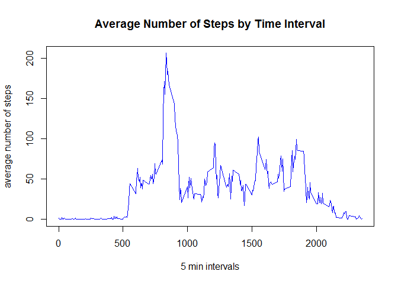
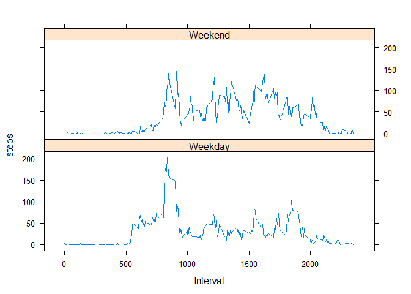

Remove the data that has na values and update format of date from factor
to be a date format

    dat <- na.omit(rdat)
    dat$date <- as.Date(dat$date)

What is mean total number of steps taken per day?
=================================================

    spd <- aggregate(steps ~ date, dat, sum)
    hist(spd$steps, xlab = "NUmber of Steps per day", main = "Histrogram of total number of steps taken per day", col= "blue")

    summary(spd)

    ##       date                steps      
    ##  Min.   :2012-10-02   Min.   :   41  
    ##  1st Qu.:2012-10-16   1st Qu.: 8841  
    ##  Median :2012-10-29   Median :10765  
    ##  Mean   :2012-10-30   Mean   :10766  
    ##  3rd Qu.:2012-11-16   3rd Qu.:13294  
    ##  Max.   :2012-11-29   Max.   :21194

What is the average daily activity pattern?
===========================================

Let's plot it on a graph

    avgspi <- aggregate(steps ~ interval, dat, mean)
    plot(avgspi$interval,avgspi$steps, type='l', xlab = "5 min intervals", ylab = "average number of steps", main = "Average Number of Steps by Time Interval", col = "blue")

5-minute interval, on average across all the days in the dataset, with
the maximum number of steps

    avgspi$interval[which.max(avgspi$steps)]

    ## [1] 835

Imputing missing values
=======================

    sum(is.na(rdat))

    ## [1] 2304

    rdatc <- rdat
    rdatc$date <- as.Date(rdatc$date)
    rdatc$steps[is.na(rdatc$steps)] <- 0

    spd2 <- aggregate(steps ~ date, rdatc, sum)

    hist(spd2$steps, xlab = "Number of Steps per day", main = "Histrogram of total number of steps taken per day missing data assigned 0", col= "red")

    summary(spd2)

    ##       date                steps      
    ##  Min.   :2012-10-01   Min.   :    0  
    ##  1st Qu.:2012-10-16   1st Qu.: 6778  
    ##  Median :2012-10-31   Median :10395  
    ##  Mean   :2012-10-31   Mean   : 9354  
    ##  3rd Qu.:2012-11-15   3rd Qu.:12811  
    ##  Max.   :2012-11-30   Max.   :21194

By assigning the NA values to 0, the median and the mean dropped
significantly compared to just removing them from the sample to
calculate mean and median. For example - the mean went from 10766 to
9385 steps per day.

Are there differences in activity patterns between weekdays and weekends?
=========================================================================

    library(lattice)
    numdate <- as.POSIXlt(rdatc$date)$wday
    newdat <- cbind(rdatc,numdate)
    wEndOrDay <- ifelse(newdat$numdate == 6 | newdat$numdate ==0,"Weekend","Weekday")
    wdat <- cbind(newdat,wEndOrDay)

    avgswe <- aggregate(steps ~ date + wEndOrDay, wdat, mean)
    xyplot(steps ~ date | wEndOrDay, avgswe, type = 'l', layout = c(1,2),xlab = "Date", ylabel= "Avg Num of Steps")

